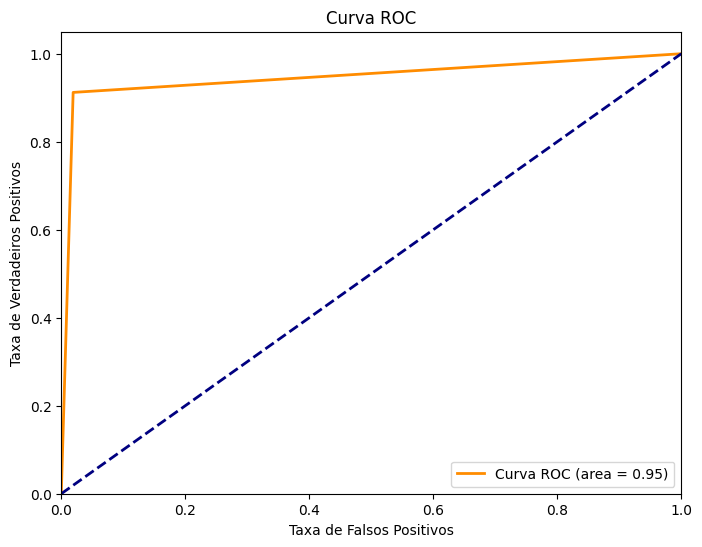
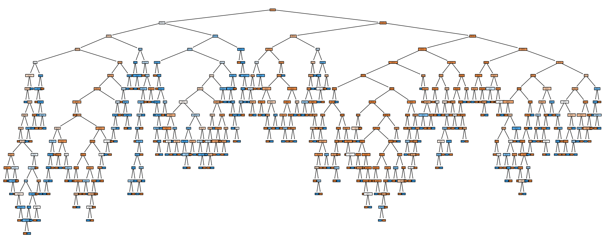
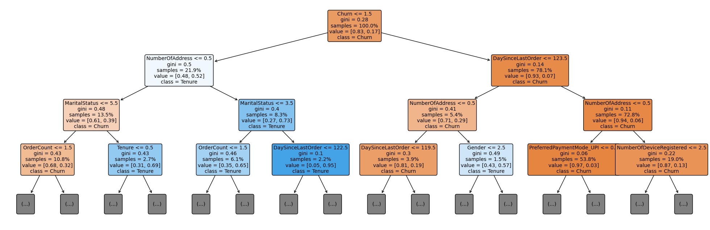

# Análise e previsão de churn para e-commerce

**Observação! Após estudar mais, percebi que fiz alguns erros no processo de criação do modelo, logo criarei uma nova pasta com o processo mais refinado**

**O que você vai encontrar aqui?**

Nessa pasta será dado continuidade em um estudo de churn para um e-commerce, focando em uma [análise](https://github.com/PedroReste/prescriptive_and_prediction_analysis/blob/main/pt_analise_e_modelo_para_previsao_de_churn_em_ecommerce/analise_de_dados_focado_para_o_modelo_de_churn.ipynb) comparando a variável churn com as demais do dataset e [geração de modelos](https://github.com/PedroReste/prescriptive_and_prediction_analysis/blob/main/pt_analise_e_modelo_para_previsao_de_churn_em_ecommerce/modelo_de_previsao_de_churn_em_um_ecommerce.ipynb) de previsão para o churn.

Em outra pasta do [meu Github](https://github.com/PedroReste/diagnostics_and_descriptive_analysis/tree/main/pt_analise_de_dados_de_ecommerce_para_previsoes_de_churn), realizei uma análise exploratória geral dos dados de um e-commerce oriundo dessa [base do Kaggle](https://www.kaggle.com/datasets/ankitverma2010/ecommerce-customer-churn-analysis-and-prediction), demonstrando todos os achados gerais e pontos relevantes sobre a base de dados.

**Retomando novamente o sigficado de churn**
Ato de um cliente deixar de consumir produtos e serviços de um empresa por motivos como: insastifação ou encontrar melhor preços no concorrente. Esses clientes são conhecidos como "churners".

# **Resumo da Análise**
Realizando algumas análises gráficas não foi possível verificar um relação tão notória entre as variáveis e o churn, quando gerado o gráfico da matriz de correlação foi possível verificar que muitas das variáveis não tinham tanta relação entre si, mas a siginificância estátistica (p-valor) estava presente para maioria, principalmente com o churn.

**Matriz de Correlação**

Além desse comparativos, foi feito mais um tratamento para remover os outliers dos dados com a seguinte técnica estatística: diferença de 03 vezes o valor do desvio-padrão em relação a média dos dados, em outras palavras, dados que estavam acima ou abaixo dessa regra foram removidos para trabalharmos no modelo.

Aplicando essa técnica não causou tantas observações removidas, apenas 282 em um total de 5.630 observações, ficando pós-tratamento com 5.348 observações.

# **Resumo dos modelos**

Foi selecionado para prever o churn dessa base de clientes os modelo de Árvore de Decisão e Random Forest.

Verificando as métricas de desempenho dos modelos, ambos modelos apresentaram ótimo desempenho para classifacar e prever novos usuários com base nas suas carectrísticas.

Para estudos futuros é ainda possível aprofundar a validações para entender esses modelos poderiam entrar em produção em uma empresa e utilizar para sub-grupos para segmentos de clientes específicos e não para o geral da base.

Abaixo alguns resultados gráficos encontrados:

**Resultado da curva ROC para a Árvore de Decisão**

**Gráfico mostrando TODAS as decisões feitas pelo modelo**

**Gráfico mostrando apenas os 03 primeiros nós das decisões feitas pelo modelo**

